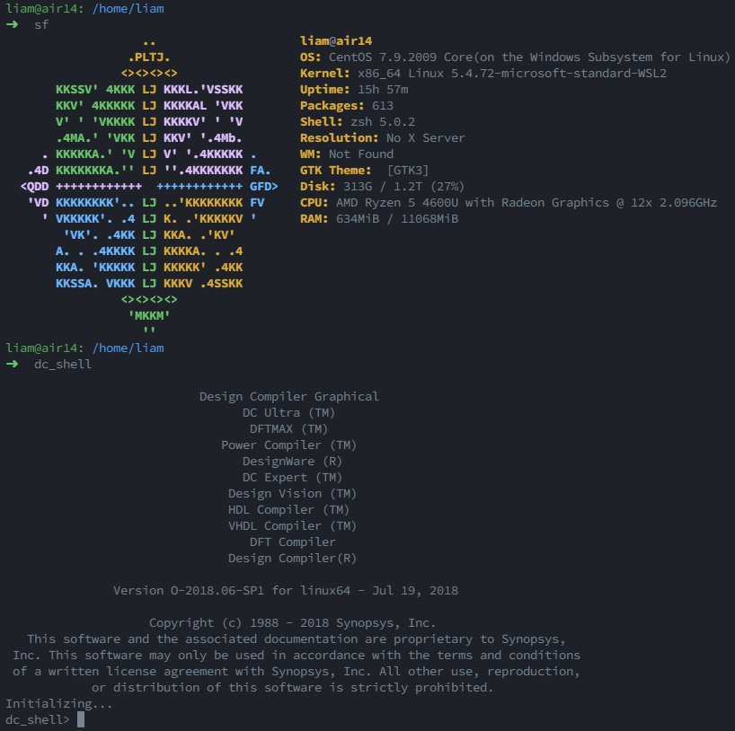

# w4e

WSL for commercial EDA tools.




## 💻Requirements

* Windows 10 1709 Fall Creators Update or later.
* Windows Subsystem for Linux feature is enabled.

See [Windows Subsystem for Linux Installation Guide for Windows 10](https://docs.microsoft.com/en-us/windows/wsl/install-win10) for more details.

## 🔧Installation

### 1. Choose a Distribution

* Download [prebuilt packages](https://docs.microsoft.com/en-us/windows/wsl/install-manual) or packages from [wsldl](https://wsldl-pg.github.io/docs/Using-wsldl/#distros).
* For Synopsys Tools, [CentOS 7](https://github.com/mishamosher/CentOS-WSL/releases/tag/7.9-2009) is recommended for installation. See [Synopsys Support of Present and Future Compute Platforms](https://www.synopsys.com/support/licensing-installation-computeplatforms/compute-platforms/compute-platforms-roadmap.html).

### 2. Basic Configuration

* Add a new user:
```shell
# useradd -m -G wheel <your username>
# passwd <your username>
```
* Uncomment this line after running `visudo`
```shell
%wheel ALL=(ALL) ALL
```
* Change mirrorlist. See [https://mirrors.tuna.tsinghua.edu.cn/help/centos/](https://mirrors.tuna.tsinghua.edu.cn/help/centos/)
* Change default user in Powershell:
```shell
> .\<distribution name>.exe config --default-user <your username>
```

### 3. Install Synopsys Tools

* Install to `/opt/synopsys`
```shell
$ sudo mkdir /opt/synopsys
$ sudo chmod 777 /opt/synopsys
```
* Use Synopsys Installer. See [Synopsys Installation Guide](https://www.synopsys.com/support/licensing-installation-computeplatforms/installation/archived-installation-guides.html) for more details.
```shell
$ ./SynopsysInstaller_v5.0.run
$ ./setup.sh
```
* Helpful commands:
```shell
$ repoquery --nvr --whatprovides <missing libs>
$ sudo yum provides <missing files>
```
* Install missing packages (may not be comprehensive...)
```shell
$ sudo yum install csh libXScrnSaver-1.2.2-6.1.el7 libXft-2.3.2-2.el7 libXi-1.7.9-1.el7 libXrandr-1.5.1-2.el7 libSM-1.2.2-2.el7 compat-libtiff3-3.9.4-12.el7 libmng-1.0.10-14.el7 libpng12-1.2.50-10.el7 libGL.so.1 libglvnd-glx-1.0.1-0.8.git5baa1e5.el7 libXcomposite-0.4.4-4.1.el7 pulseaudio-libs-10.0-6.el7_9 xkeyboard-config-2.24-1.el7.noarch redhat-lsb.i686 
```

## 📝Registration

### 1. Set static mac

Every time you restart the WSL2, the mac addresses change. See [WSL 2 - Static MAC Address or Changing MAC After Booting Without Breaking Internet Connection #5352](https://github.com/microsoft/WSL/issues/5352).

It may be solved by setting bond0's mac address fixed:

```shell
wantmac=<your wantmac>
mac=$(ip link show bond0 | awk '/ether/ {print $2}')
if [[ $mac !=  $wantmac ]]; then
    sudo ip link set dev bond0 address $wantmac
fi
```

See [How to make "ether" value from "bond0" field static across WSL sessions #5866](https://github.com/microsoft/WSL/issues/5866) for more details.

### 2. Set .zshrc

Add followings to `~/.zshrc`:

```shell
export LM_LICENSE_FILE=$SCL_HOME/admin/license/Synopsys.dat
export SNPSLMD_LICENSE_FILE=27000@localhost
```

No need to set up firewall.

### 3. Set path of snpslmd in $LM_LICENSE_FILE

Add `/opt/synopsys/scl/2018.06/linux64/bin/snpslmd` after `DAEMON snpslmd` in `$LM_LICENSE_FILE`.

### 4. Run lmgrd

```shell
$ lmgrd -c $LM_LICENSE_FILE
```

## 🔗Useful Links

* [ohmyzsh](https://github.com/ohmyzsh/ohmyzsh)
* [vimcolorschemes](https://vimcolorschemes.com/morhetz/gruvbox)
* [screenfetch](https://github.com/KittyKatt/screenFetch)
* [OpenLM License Parser Engineering Software Catalog](https://alllicenseparser.com/engineering-db/flexlm/snpslmd/index.html)
